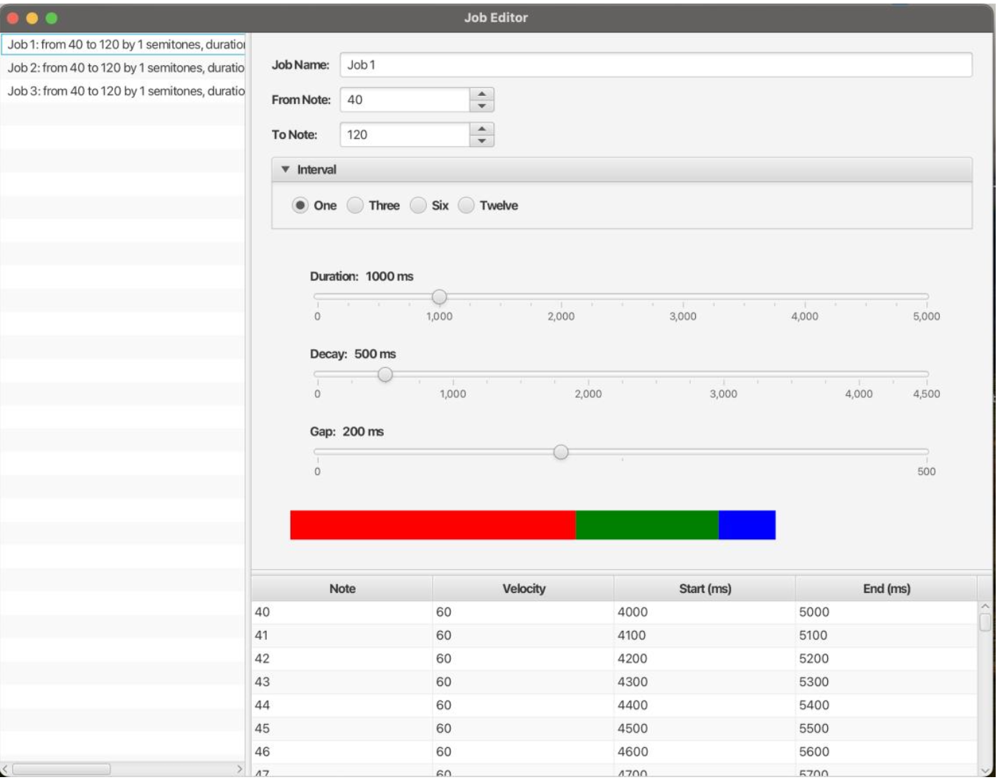

# JavaFX Musical Job Editor Project

## Overview
The **Final Project** involves the creation of an advanced JavaFX application to manage musical jobs. Each job represents a series of notes, each characterized by attributes like **duration**, **decay**, **gap**, and **velocities**. The application provides a dynamic, interactive UI, enabling real-time modifications and reflecting changes immediately.

## Development Process
1. **Planning**: Detailed project requirements were outlined, identifying key features and functionalities.
2. **Design**: User interface layouts and interactions were sketched.
3. **Implementation**: Coding was carried out using **JavaFX** for the GUI and **Java** for backend logic.
4. **Testing**: Regular testing and debugging ensured functionality and resolved issues.
5. **Collaboration**: Team communication coordinated efforts and maintained project consistency.
6. **Deployment**: Final testing and refinements delivered a polished, user-friendly job editor.

---

To compile : javac --module-path path-to/JAVAFX/javafx-sdk-22/lib --add-modules javafx.controls,javafx.fxml,javafx.graphics,javafx.base Main.java Note.java Job.java

To run: java --module-path path-to/JAVAFX/javafx-sdk-22/lib --add-modules javafx.controls,javafx.fxml,javafx.graphics,javafx.base -cp . Main

---

## Application Workflow
The **JavaFX Musical Job Editor** manages "jobs," each comprising a sequence of musical notes with specific properties. The application is divided into three main panes:

1. **Left Pane**: Displays a list of jobs. Users can select and edit a job.
2. **Top Right Pane**: Enables editing of job parameters with:
   - Spinners for numeric values.
   - Sliders for continuous adjustments.
   - Radio buttons for predefined options.
   - Graphical representation of **note duration**, **decay**, and **gap**.
3. **Bottom Right Pane**: Provides a **TableView** for note details, allowing property edits.

Dynamic updates ensure changes in parameters immediately reflect in the UI.

---

## Key Features
- **Split View Layout**: Vertical and horizontal split panes for flexible organization.
- **Dynamic UI Updates**: Real-time updates for tables and graphs.
- **Job and Note Management**: Each job is an instance of the `Job` class, with methods to manage updates and interactions.
- **Editable Velocities**: Double-click to edit velocities directly in the table, then press Enter to save.

---

## Implementation Details

### Methods in the Main Class
1. **`start(Stage primaryStage)`**: Initializes the application and displays the main stage.
2. **`saveJobDetails(Job job)`**: Saves job attributes like name, notes range, interval, duration, decay, and gap.
3. **`initializeComponents()`**: Sets up all UI components (sliders, labels, text fields, etc.).
4. **`updateJobAndNotesTable()`**: Refreshes the notes table with the current job's details.
5. **`updateNotesTable(Job job)`**: Updates the notes table for the selected job.
6. **`loadJobDetails(Job job)`**: Loads a job's details into UI components for editing.
7. **`createJobEditorPane()`**: Configures a split pane for job details and timing editor.
8. **`createJobDetailsAndTimingEditor()`**: Sets up a VBox for job details and timing editor components.
9. **`createJobDetailsGrid()`**: Configures a grid for job details (name, notes range, interval).
10. **`createIntervalBox()`**: Sets up radio buttons for job interval selection.
11. **`updateRadioButtonGroup(Job.Interval interval)`**: Updates radio button selection.
12. **`createJobTimingEditor()`**: Sets up sliders for **duration**, **decay**, and **gap**.
13. **`createSliderSection(String labelName, double min, double max, Slider slider, Label valueLabel)`**: Creates a slider with a label.
14. **`setupSlider(Slider slider, Label valueLabel)`**: Configures slider listeners and updates.
15. **`updateJobBasedOnSlider(Slider slider)`**: Adjusts job parameters based on slider values.
16. **`drawTiming()`**: Visualizes timing on a canvas based on job parameters.
17. **`createNotesTableView()`**: Configures a `TableView` for note properties (velocity, start/end times).
18. **`createNotesList(Job job)`**: Generates a note list based on job details.

---

## User Interface (UI)
The UI emphasizes clarity and usability, ensuring users can:
- Select and manage multiple jobs.
- Adjust job properties via intuitive controls.
- View real-time updates in tables and graphical representations.

---

## Summary
This **JavaFX Musical Job Editor** is a robust tool for managing musical jobs, offering a seamless and interactive user experience. The combination of dynamic UI updates, detailed note editing, and real-time graphical feedback makes it an invaluable tool for musical project management.

